# 🚀 MLflow YOLO Platform - Dual Deployment Architecture

> **Deploy enterprise-grade ML infrastructure with two flexible deployment options**

A comprehensive Terraform platform for YOLO model training and experiment tracking, offering both **SageMaker Studio** and **Custom EC2-based** deployment options.

## 🎯 **Deployment Options**

### **Option 1: SageMaker Studio (Recommended)**
```
🧠 SageMaker MLflow Tracking Server  ←  Fully managed, auto-scaling
🏢 SageMaker Studio Domain           ←  Integrated development environment
👤 SageMaker User Profile            ←  Ready-to-use workspace
💾 S3 Bucket (versioned + encrypted)  ←  Unlimited artifact storage  
🔑 IAM Role (comprehensive permissions) ←  Secure, least-privilege access
```

**Best for:** Teams wanting a fully managed, integrated development environment
- Managed MLflow Tracking Server (fully managed by AWS)
- Integrated Jupyter Server and Code Editor
- No server management required
- Built-in security and compliance features
- Team collaboration capabilities

### **Option 2: Custom EC2-based MLflow with RDS**
```
🖥️ EC2 MLflow Server                 ←  Self-hosted, full control
🗄️ RDS MySQL Database               ←  Scalable backend store
💾 S3 Bucket (versioned + encrypted)  ←  Unlimited artifact storage
🔐 Secrets Manager                   ←  Secure credential storage
🔑 IAM Roles & Security Groups       ←  Comprehensive security
📊 CloudWatch Logging               ←  Complete monitoring
```

**Best for:** Teams wanting full control over MLflow server and database
- Self-hosted MLflow server on EC2
- MySQL RDS database for experiment metadata
- Full customization capabilities
- Direct access to server for debugging
- Cost optimization opportunities

## 🏗️ **Architecture Diagrams**

### **SageMaker Studio Architecture**

```mermaid
graph TB
    subgraph "Developer Environment"
        DEV[👨‍💻 ML Team]
        BROWSER[🌐 Web Browser]
    end

    subgraph "AWS SageMaker Studio Infrastructure"
        subgraph "Core Components"
            STUDIO[🏢 SageMaker Studio<br/>Domain<br/>Integrated IDE]
            USER[👤 User Profile<br/>Personal Workspace<br/>Team Collaboration]
            MLFLOW[🧠 SageMaker MLflow<br/>Tracking Server<br/>Fully Managed]
        end
        
        subgraph "Storage & Security"
            S3[💾 S3 Bucket<br/>Versioned + Encrypted<br/>Artifact Storage]
            IAM[🔑 IAM Role<br/>Studio Permissions<br/>Secure Access]
        end
        
        subgraph "Compute (On-Demand)"
            TRAIN[🚀 SageMaker Training<br/>GPU Instances<br/>ml.g4dn.xlarge+]
            NOTEBOOK[📓 Studio Notebooks<br/>Jupyter Environment<br/>Pre-configured]
        end
    end

    DEV --> BROWSER
    BROWSER --> STUDIO
    STUDIO --> USER
    USER --> NOTEBOOK
    NOTEBOOK --> TRAIN
    TRAIN --> MLFLOW
    MLFLOW --> S3
    TRAIN --> S3
    STUDIO -.-> IAM
    MLFLOW -.-> IAM

    classDef studio fill:#fff3e0,stroke:#ff9800,stroke-width:3px
    classDef storage fill:#e8f5e8,stroke:#4caf50,stroke-width:2px
    classDef compute fill:#f3e5f5,stroke:#9c27b0,stroke-width:2px
    classDef user fill:#e1f5fe,stroke:#2196f3,stroke-width:2px
    
    class STUDIO,USER,MLFLOW studio
    class S3,IAM storage
    class TRAIN,NOTEBOOK compute
    class DEV,BROWSER user
```


### **Custom EC2-based Architecture**

```mermaid
graph TB
    subgraph "Developer Environment"
        DEV[👨‍💻 Developer]
        TOOLS[🛠️ Local Tools<br/>VS Code, CLI, etc.]
    end

    subgraph "AWS Custom EC2-based Infrastructure"
        subgraph "Application Layer"
            EC2[🖥️ EC2 Instance<br/>MLflow Server<br/>Auto-configured]
            MLflow[🧠 MLflow Service<br/>Port 5000<br/>Web Interface]
        end
        
        subgraph "Data Layer"
            RDS[🗄️ RDS MySQL<br/>Backend Store<br/>Experiment Metadata]
            S3[💾 S3 Bucket<br/>Versioned + Encrypted<br/>Artifact Storage]
        end
        
        subgraph "Security & Monitoring"
            SECRETS[🔐 Secrets Manager<br/>Database Credentials<br/>Encrypted Storage]
            SG[🛡️ Security Groups<br/>Network Access Control<br/>Port Management]
            LOGS[📊 CloudWatch Logs<br/>Application Monitoring<br/>Health Tracking]
            IAM[🔑 IAM Roles<br/>Service Permissions<br/>S3 Access]
        end
        
        subgraph "Compute (On-Demand)"
            TRAIN[🚀 SageMaker Training<br/>GPU Instances<br/>ml.g4dn.xlarge+]
        end
    end

    DEV --> TOOLS
    TOOLS -.-> EC2
    EC2 --> MLflow
    MLflow --> RDS
    MLflow --> S3
    EC2 -.-> SECRETS
    EC2 -.-> SG
    EC2 -.-> LOGS
    EC2 -.-> IAM
    TOOLS -.-> TRAIN
    TRAIN --> MLflow
    TRAIN --> S3

    classDef application fill:#e3f2fd,stroke:#1976d2,stroke-width:3px
    classDef data fill:#e8f5e8,stroke:#4caf50,stroke-width:2px
    classDef security fill:#fce4ec,stroke:#e91e63,stroke-width:2px
    classDef compute fill:#f3e5f5,stroke:#9c27b0,stroke-width:2px
    classDef user fill:#e1f5fe,stroke:#2196f3,stroke-width:2px
    
    class EC2,MLflow application
    class RDS,S3 data
    class SECRETS,SG,LOGS,IAM security
    class TRAIN compute
    class DEV,TOOLS user
```


## ⚡ **Quick Start**

### **Studio Deployment (Recommended)**
```bash
# 1. Clone and navigate
git clone <your-repo>
cd terraform-sagemaker-yolo/terraform

# 2. Configure for Studio
cp terraform-studio.tfvars.example terraform.tfvars
# Edit terraform.tfvars with your settings

# 3. Deploy
terraform init
terraform plan    # Review infrastructure
terraform apply   # Deploy (5-8 minutes)

# 4. Access Studio
# Go to AWS Console → SageMaker → Studio → Launch Studio
```

### **Custom Deployment**
```bash
# ⚠️  IMPORTANT: Key pair is REQUIRED for Custom mode
# Create AWS Key Pair FIRST (before terraform apply)
aws ec2 create-key-pair --key-name my-mlflow-key \
    --query 'KeyMaterial' --output text > my-mlflow-key.pem
chmod 400 my-mlflow-key.pem

# 2. Configure for Custom deployment
cp terraform-custom.tfvars.example terraform.tfvars
# Edit terraform.tfvars: set key_pair_name = "my-mlflow-key"

# 3. Deploy
terraform init
terraform plan    # Review infrastructure
terraform apply   # Deploy (8-12 minutes)

# 4. Access MLflow
# Open the MLflow UI URL from terraform outputs
```

## 📊 **Deployment Comparison**

| Feature | Studio Mode | Custom Mode |
|---------|-------------|----------|
| **Management** | Fully managed | Self-managed |
| **Setup Time** | 30-40 minutes* | 8-12 minutes |
| **Monthly Cost** | $80-150 | $50-100 |
| **IDE Access** | Built-in browser IDE | External tools |
| **Team Collaboration** | Native Studio features | Via MLflow UI only |
| **Customization** | Limited to Studio config | Full server control |
| **Scaling** | Automatic | Manual configuration |
| **Maintenance** | AWS managed | User managed |

*Setting up a MLFlow Server takes ~25 min.

## 🛠️ **Configuration**

### **Common Variables**
```hcl
# terraform.tfvars
aws_region = "us-east-1"
project_name = "my-yolo-project"
deployment_mode = "studio"  # or "custom"
sagemaker_instance_type = "ml.g4dn.xlarge"
```

### **Studio-specific**
```hcl
studio_domain_name = ""  # Auto-generated if empty
enable_studio_code_editor = true
enable_studio_jupyter_server = true
```

### **Custom-specific**
```hcl
ec2_instance_type = "t3.medium"
key_pair_name = "my-key-pair"  # REQUIRED
db_instance_class = "db.t3.micro"
db_allocated_storage = 20
```

## 🚀 **Using the Platform**

### **Studio Mode Workflow**
```python
# In SageMaker Studio notebook
import mlflow
import mlflow.pytorch

# MLflow is automatically configured
mlflow.set_experiment("yolo-v11-experiment")

with mlflow.start_run():
    # Your YOLO training code
    model = train_yolo_model(data_path="s3://bucket/dataset/")
    
    # Log metrics and artifacts
    mlflow.log_metric("map50", 0.85)
    mlflow.pytorch.log_model(model, "yolo-model")
```

### **Custom Mode Workflow**
```python
# Local development or remote training
import mlflow
import mlflow.pytorch

# Set tracking URI to your Custom EC2 MLflow server
mlflow.set_tracking_uri("http://YOUR_EC2_IP:5000")
mlflow.set_experiment("yolo-v11-experiment")

with mlflow.start_run():
    # Your YOLO training code
    model = train_yolo_model(data_path="s3://bucket/dataset/")
    
    # Log metrics and artifacts
    mlflow.log_metric("map50", 0.85)
    mlflow.pytorch.log_model(model, "yolo-model")
```

### **SageMaker Training Integration**
```python
# Works with both deployment modes
from sagemaker.pytorch import PyTorch

# Use the appropriate role from terraform outputs
role_arn = "arn:aws:iam::123456789012:role/your-execution-role"

estimator = PyTorch(
    entry_point="train.py",
    role=role_arn,
    instance_type="ml.g4dn.xlarge",
    framework_version="2.0",
    environment={
        "MLFLOW_TRACKING_URI": "YOUR_MLFLOW_SERVER_URL"
    }
)

estimator.fit("s3://your-bucket/datasets/")
```

## 📈 **Datasets & Training**

### **Quick Start Datasets**
```bash
# Download sample YOLO dataset
pip install roboflow
python -c "
from roboflow import Roboflow
rf = Roboflow(api_key='YOUR_API_KEY') # Get key from Roboflow dashboard
project = rf.workspace('roboflow-universe-projects').project('beverage-containers-3atxb')
dataset = project.version(3).download('yolov11')
"

# Upload to S3
aws s3 sync ./beverage-containers-8/ s3://your-bucket/datasets/beverages/
```

### **Custom Dataset Format**
```
datasets/
└── your_dataset/
    ├── images/
    │   ├── train/
    │   ├── val/
    │   └── test/
    ├── labels/
    │   ├── train/
    │   ├── val/
    │   └── test/
    └── data.yaml
```

## 🔒 **Security Features**

### **Built-in Security**
- ✅ **S3 Encryption**: AES-256 server-side encryption
- ✅ **Access Control**: IAM roles with least-privilege
- ✅ **Network Security**: Security groups and VPC isolation
- ✅ **Credential Management**: Secrets Manager integration
- ✅ **Audit Logging**: CloudTrail and CloudWatch integration

### **Studio Mode Security**
- AWS managed security policies
- IAM-based authentication
- VPC isolation capabilities
- Enterprise compliance ready

### **Custom Mode Security**
- Private database subnets
- Encrypted credential storage
- SSH key-based access
- Configurable security groups

## 💰 **Cost Optimization**

### **Studio Mode Costs**
```
Monthly Estimate (us-east-1):
├── Studio Domain: $30-50
├── MLflow Tracking Server: $20-40
├── S3 Storage (10GB): $3-5
├── Training (50 hours): $30-50
└── Total: ~$80-150/month
```

### **Custom Mode Costs**
```
Monthly Estimate (us-east-1):
├── EC2 t3.medium (24/7): $30-40
├── RDS db.t3.micro: $15-25
├── S3 Storage (10GB): $3-5
├── Training (50 hours): $30-50
└── Total: ~$50-100/month
```

### **Cost Optimization Tips**
- 🎯 Use Spot instances for training (90% savings)
- ⏰ Stop/start EC2 instances during off-hours
- 📊 Monitor usage with CloudWatch
- 💾 Use S3 Intelligent Tiering for storage

## 📊 **Monitoring & Observability**

### **CloudWatch Integration**
- Application performance metrics
- Infrastructure health monitoring
- Custom dashboards and alerts
- Log aggregation and analysis

### **MLflow Tracking**
- Experiment comparison and visualization
- Model registry and versioning
- Artifact storage and retrieval
- Collaborative experiment management

## 🧹 **Cleanup**

```bash
# Destroy all infrastructure
terraform destroy

# Confirm deletion of S3 objects if needed
aws s3 rm s3://your-bucket-name --recursive
```

## 🛠️ **Troubleshooting**

### **Common Issues**

#### **Custom Mode: Missing Key Pair Error**
```
❌ Custom deployment mode requires key_pair_name to be set in terraform.tfvars
```

**Solution:**
```bash
# 1. Create the key pair
aws ec2 create-key-pair --key-name my-key \
    --query 'KeyMaterial' --output text > my-key.pem
chmod 600 my-key.pem

# 2. Update terraform.tfvars
# Set: key_pair_name = "my-key"

# 3. Apply terraform
terraform apply
```

#### **Studio Mode: MLflow Server Setup Takes 25+ Minutes**
This is normal behavior. The SageMaker MLflow tracking server requires initial setup time.

**Monitoring Progress:**
```bash
# Check CloudFormation stack status
aws cloudformation describe-stacks \
    --stack-name sagemaker-mlflow-* \
    --query 'Stacks[0].StackStatus'
```

#### **S3 Access Denied Errors**
**Solution:** Verify IAM roles have proper S3 permissions:
```bash
# Check IAM role policies
aws iam list-attached-role-policies --role-name YourRoleName
```

#### **RDS Connection Issues (Custom Mode)**
**Solution:** Check security groups and VPC configuration:
```bash
# Test database connectivity from EC2
terraform output rds_endpoint
# SSH into EC2 and test: mysql -h <endpoint> -u <username> -p
```

#### **Terraform State Lock Issues**
**Solution:**
```bash
# Force unlock (use with caution)
terraform force-unlock <lock-id>

# Or check for existing terraform processes
ps aux | grep terraform
```

### **Getting Help**
- 📋 Check CloudWatch logs for detailed error messages
- 🔍 Use `terraform plan` to preview changes before applying
- 📞 AWS Support for service-specific issues
- 📖 Terraform documentation for configuration problems

## 🔄 **Migration & Upgrades**

### **Switch Between Modes**
```bash
# Change deployment_mode in terraform.tfvars
deployment_mode = "custom"  # Switch from "studio" to "custom"

# Apply changes (S3 bucket and data preserved)
terraform plan
terraform apply
```

### **Zero-Downtime Upgrade Path**
- S3 artifacts remain accessible during migration
- MLflow data can be exported/imported
- Gradual migration strategies supported

## 🛠️ **Advanced Configuration**

### **Custom VPC Deployment**
Both modules can be modified to use custom VPCs for enhanced network control.

### **High Availability Setup**
- Multi-AZ RDS deployment
- Application Load Balancer integration
- Auto Scaling Groups for Custom mode

### **CI/CD Integration**
```yaml
# Example GitHub Actions workflow
name: MLflow Training Pipeline
on: [push]
jobs:
  train:
    runs-on: ubuntu-latest
    steps:
      - uses: actions/checkout@v2
      - name: Deploy Infrastructure
        run: |
          terraform init
          terraform apply -auto-approve
      - name: Run Training
        run: python train.py
```

## 📚 **Documentation**

- 📖 [Detailed Setup Guide](terraform/README.md)
- 🎯 [YOLO Training Examples](docs/training-examples.md)
- 🔧 [Troubleshooting Guide](docs/troubleshooting.md)
- 🏗️ [Architecture Deep Dive](docs/architecture.md)

## 🤝 **Contributing**

We welcome contributions! Please see our [Contributing Guide](CONTRIBUTING.md) for details.

## 📄 **License**

This project is licensed under the MIT License - see the [LICENSE](LICENSE) file for details.

---

## 🌟 **Why Choose This Platform?**

✅ **Flexibility**: Two deployment options for different team needs  
✅ **Enterprise Ready**: Security, compliance, and scalability built-in  
✅ **Cost Effective**: Optimized resource usage and scaling  
✅ **Easy Migration**: Switch between deployment modes seamlessly  
✅ **Production Proven**: Battle-tested in real ML workflows  

**Get started in under 10 minutes** → Choose your deployment mode and `terraform apply` 🚀 