# 🚀 SageMaker MLflow YOLO Platform - Dual Deployment Architecture

**NOTE:** This is a WORK-IN-PROCESS.

> **Deploy enterprise-grade ML infrastructure with two flexible deployment options**

A comprehensive Terraform platform for YOLO model training and experiment tracking, offering both **SageMaker Studio** and **Custom EC2-based** deployment options.

## 🎯 **Deployment Options**

### **Option 1: SageMaker Studio (Recommended)**
```
🧠 SageMaker MLflow Tracking Server  ←  Fully managed, auto-scaling
🏢 SageMaker Studio Domain           ←  Integrated development environment
👤 SageMaker User Profile            ←  Ready-to-use workspace
💾 S3 Bucket (versioned + encrypted)  ←  Unlimited artifact storage  
🔑 IAM Role (comprehensive permissions) ←  Secure, least-privilege access
```

**Best for:** Teams wanting a fully managed, integrated development environment
- Managed MLflow Tracking Server (fully managed by AWS)
- Integrated Jupyter Server and Code Editor
- No server management required
- Built-in security and compliance features
- Team collaboration capabilities

### **Option 2: Custom EC2-based MLflow with RDS**
```
🖥️ EC2 MLflow Server                 ←  Self-hosted, full control
🗄️ RDS MySQL Database               ←  Scalable backend store
💾 S3 Bucket (versioned + encrypted)  ←  Unlimited artifact storage
🔐 Secrets Manager                   ←  Secure credential storage
🔑 IAM Roles & Security Groups       ←  Comprehensive security
📊 CloudWatch Logging               ←  Complete monitoring
```

**Best for:** Teams wanting full control over MLflow server and database
- Self-hosted MLflow server on EC2
- MySQL RDS database for experiment metadata
- Full customization capabilities
- Direct access to server for debugging
- Cost optimization opportunities

## 🏗️ **Architecture Diagrams**

### **SageMaker Studio Architecture**

```mermaid
graph TB
    subgraph "Developer Environment"
        DEV[👨‍💻 ML Team]
        BROWSER[🌐 Web Browser]
    end

    subgraph "AWS SageMaker Studio Infrastructure"
        subgraph "Core Components"
            STUDIO[🏢 SageMaker Studio<br/>Domain<br/>Integrated IDE]
            USER[👤 User Profile<br/>Personal Workspace<br/>Team Collaboration]
            MLFLOW[🧠 SageMaker MLflow<br/>Tracking Server<br/>Fully Managed]
        end
        
        subgraph "Storage & Security"
            S3[💾 S3 Bucket<br/>Versioned + Encrypted<br/>Artifact Storage]
            IAM[🔑 IAM Role<br/>Studio Permissions<br/>Secure Access]
        end
        
        subgraph "Compute (On-Demand)"
            TRAIN[🚀 SageMaker Training<br/>GPU Instances<br/>ml.g4dn.xlarge+]
            NOTEBOOK[📓 Studio Notebooks<br/>Jupyter Environment<br/>Pre-configured]
        end
    end

    DEV --> BROWSER
    BROWSER --> STUDIO
    STUDIO --> USER
    USER --> NOTEBOOK
    NOTEBOOK --> TRAIN
    TRAIN --> MLFLOW
    MLFLOW --> S3
    TRAIN --> S3
    STUDIO -.-> IAM
    MLFLOW -.-> IAM

    classDef studio fill:#fff3e0,stroke:#ff9800,stroke-width:3px
    classDef storage fill:#e8f5e8,stroke:#4caf50,stroke-width:2px
    classDef compute fill:#f3e5f5,stroke:#9c27b0,stroke-width:2px
    classDef user fill:#e1f5fe,stroke:#2196f3,stroke-width:2px
    
    class STUDIO,USER,MLFLOW studio
    class S3,IAM storage
    class TRAIN,NOTEBOOK compute
    class DEV,BROWSER user
```


### **Custom EC2-based Architecture**

```mermaid
graph TB
    subgraph "Developer Environment"
        DEV[👨‍💻 Developer]
        TOOLS[🛠️ Local Tools<br/>VS Code, CLI, etc.]
    end

    subgraph "AWS Custom EC2-based Infrastructure"
        subgraph "Application Layer"
            EC2[🖥️ EC2 Instance<br/>MLflow Server<br/>Auto-configured]
            MLflow[🧠 MLflow Service<br/>Port 5000<br/>Web Interface]
        end
        
        subgraph "Data Layer"
            RDS[🗄️ RDS MySQL<br/>Backend Store<br/>Experiment Metadata]
            S3[💾 S3 Bucket<br/>Versioned + Encrypted<br/>Artifact Storage]
        end
        
        subgraph "Security & Monitoring"
            SECRETS[🔐 Secrets Manager<br/>Database Credentials<br/>Encrypted Storage]
            SG[🛡️ Security Groups<br/>Network Access Control<br/>Port Management]
            LOGS[📊 CloudWatch Logs<br/>Application Monitoring<br/>Health Tracking]
            IAM[🔑 IAM Roles<br/>Service Permissions<br/>S3 Access]
        end
        
        subgraph "Compute (On-Demand)"
            TRAIN[🚀 SageMaker Training<br/>GPU Instances<br/>ml.g4dn.xlarge+]
        end
    end

    DEV --> TOOLS
    TOOLS -.-> EC2
    EC2 --> MLflow
    MLflow --> RDS
    MLflow --> S3
    EC2 -.-> SECRETS
    EC2 -.-> SG
    EC2 -.-> LOGS
    EC2 -.-> IAM
    TOOLS -.-> TRAIN
    TRAIN --> MLflow
    TRAIN --> S3

    classDef application fill:#e3f2fd,stroke:#1976d2,stroke-width:3px
    classDef data fill:#e8f5e8,stroke:#4caf50,stroke-width:2px
    classDef security fill:#fce4ec,stroke:#e91e63,stroke-width:2px
    classDef compute fill:#f3e5f5,stroke:#9c27b0,stroke-width:2px
    classDef user fill:#e1f5fe,stroke:#2196f3,stroke-width:2px
    
    class EC2,MLflow application
    class RDS,S3 data
    class SECRETS,SG,LOGS,IAM security
    class TRAIN compute
    class DEV,TOOLS user
```


## ⚡ **Quick Start**

### **Studio Deployment (Recommended)**
```bash
# Configure for Studio
cp terraform-studio.tfvars.example terraform.tfvars
# Edit terraform.tfvars with your settings

bash scripts/deploy.sh

# Access Studio
# Go to AWS Console → SageMaker → Studio → Launch Studio
```

## 📊 **Deployment Comparison**

| Feature | Studio Mode | Custom Mode |
|---------|-------------|----------|
| **Management** | Fully managed | Self-managed |
| **Setup Time** | 30-40 minutes* | 20-30 minutes |
| **Monthly Cost** | $80-150 | $50-100 |
| **IDE Access** | Built-in browser IDE | External tools |
| **Team Collaboration** | Native Studio features | Via MLflow UI only |
| **Customization** | Limited to Studio config | Full server control |
| **Scaling** | Automatic | Manual configuration |
| **Maintenance** | AWS managed | User managed |

*Setting up a MLFlow Server takes ~25 min.

## 🛠️ **Configuration**

### **Common Variables**
```hcl
# terraform.tfvars
aws_region = "us-east-1"
project_name = "my-yolo-project"
deployment_mode = "studio"  # or "custom"
sagemaker_instance_type = "ml.g4dn.xlarge"
```

### **Studio-specific**
```hcl
studio_domain_name = ""  # Auto-generated if empty
enable_studio_code_editor = true
enable_studio_jupyter_server = true
```

### **Custom-specific**
```hcl
ec2_instance_type = "t3.medium"
key_pair_name = "my-key-pair"  # REQUIRED
db_instance_class = "db.t3.micro"
db_allocated_storage = 20
```

### **Quick Start Datasets**
```bash
cd data

# Download sample YOLO dataset
pip install roboflow
python -c "
from roboflow import Roboflow
rf = Roboflow(api_key='YOUR_API_KEY') # Get key from Roboflow dashboard
project = rf.workspace('roboflow-universe-projects').project('beverage-containers-3atxb')
dataset = project.version(1).download('yolov11')
"

# Upload to S3
aws s3 sync ./Beverage-Containers-3/ s3://your-bucket/datasets/beverages/
```

### **Custom Dataset Format**
```
datasets/
└── your_dataset/
    ├── images/
    │   ├── train/
    │   ├── val/
    │   └── test/
    ├── labels/
    │   ├── train/
    │   ├── val/
    │   └── test/
    └── data.yaml
```

## 🚀 **YOLO Training Instructions**

> **Simple 2-step process: Edit config and run training script**

### **Prerequisites**
```bash
cd terraform

# Get your infrastructure details
terraform output mlflow_tracking_uri
terraform output s3_bucket_name
```

### **Step 1: Configure Training**

Edit the appropriate config file based on your deployment:

**For Studio Mode:** `configs/studio_training_config.yaml`
```yaml
# Studio SageMaker Training Configuration
mlflow_uri: "https://mlflow-tracking-123456789.us-east-1.sagemaker.aws/"  # From terraform output
s3_bucket: "your-terraform-bucket-name"  # From terraform output
dataset_key: "datasets/beverages/"  # Your dataset path in S3

# Training Parameters
model_size: "yolo11s"  # Options: yolo11n, yolo11s, yolo11m, yolo11l, yolo11x
epochs: 50
batch_size: 16
image_size: 640
experiment_name: "beverage-detection-v1"

# SageMaker Configuration
instance_type: "ml.g4dn.xlarge"
use_spot_instances: true  # 90% cost savings
max_run_hours: 24
```

**For Custom Mode:** `configs/custom_training_config.yaml`
```yaml
# Custom EC2 Training Configuration
mlflow_uri: "http://YOUR_EC2_IP:5000"  # From terraform output ec2_public_ip
s3_bucket: "your-terraform-bucket-name"  # From terraform output
dataset_key: "datasets/beverages/"  # Your dataset path in S3

# Training Parameters
model_size: "yolo11s"  # Options: yolo11n, yolo11s, yolo11m, yolo11l, yolo11x
epochs: 50
batch_size: 16
image_size: 640
experiment_name: "beverage-detection-v1"

# SageMaker Configuration
instance_type: "ml.g4dn.xlarge"
use_spot_instances: true  # 90% cost savings
max_run_hours: 24
```

### **Step 2: Run Training**

**For Studio Mode:**
```bash
python examples/studio_sagemaker_training.py
```

**For Custom Mode:**
```bash
python examples/custom_sagemaker_training.py
```

### **Training Parameters Guide**

| Parameter | Description | Recommended Values |
|-----------|-------------|-------------------|
| `model_size` | YOLO model variant | `yolo11n` (fast), `yolo11s` (balanced), `yolo11m` (accurate) |
| `epochs` | Training iterations | 50-100 (start with 50) |
| `batch_size` | Batch size | 16 (adjust based on GPU memory) |
| `image_size` | Input image size | 640 (standard), 1024 (high-res) |

### **Instance Type Recommendations**

| Instance Type | GPU Memory | Recommended Use | Approx. Cost/Hour |
|---------------|------------|-----------------|-------------------|
| `ml.g4dn.xlarge` | 16GB | Small-medium datasets | $0.736 |
| `ml.g4dn.2xlarge` | 32GB | Large datasets | $1.180 |
| `ml.g5.xlarge` | 24GB | Latest GPU, faster training | $1.408 |
| `ml.p3.2xlarge` | 16GB | High-performance training | $3.825 |

### **Monitoring Training Progress**

#### **Studio Mode**
```python
# Access MLflow UI directly in SageMaker Studio
# Go to: SageMaker Console → Studio → Open Studio → MLflow
```

#### **Custom Mode**
```bash
# Access MLflow UI at your EC2 instance
echo "MLflow UI: http://$(terraform output ec2_public_ip):5000"

# Or tunnel if using private subnets
ssh -L 5000:localhost:5000 -i your-key.pem ubuntu@EC2_IP
# Then access: http://localhost:5000
```

### **Training Output & Artifacts**

After training completes, you'll find:

```
📊 MLflow UI Dashboard:
├── 📈 Training metrics (mAP, loss, precision, recall)
├── 📋 Parameters (model_size, epochs, batch_size)
├── 🎯 Model artifacts (best.pt, last.pt)
├── 📊 Training plots (confusion matrix, F1 curve)
└── 📝 Training logs and system info

💾 S3 Bucket:
├── 🔄 Model checkpoints
├── 📊 Training artifacts
└── 📈 Experiment data
```

## 💰 **Cost Optimization**

### **Studio Mode Costs**
```
Monthly Estimate (us-east-1):
├── Studio Domain: $30-50
├── MLflow Tracking Server: $20-40
├── S3 Storage (10GB): $3-5
├── Training (50 hours): $30-50
└── Total: ~$80-150/month
```

### **Custom Mode Costs**
```
Monthly Estimate (us-east-1):
├── EC2 t3.medium (24/7): $30-40
├── RDS db.t3.micro: $15-25
├── S3 Storage (10GB): $3-5
├── Training (50 hours): $30-50
└── Total: ~$50-100/month
```

### **Cost Optimization Tips**
- 🎯 Use Spot instances for training (90% savings)
- ⏰ Stop/start EC2 instances during off-hours
- 📊 Monitor usage with CloudWatch
- 💾 Use S3 Intelligent Tiering for storage

## 📊 **Monitoring & Observability**

### **CloudWatch Integration**
- Application performance metrics
- Infrastructure health monitoring
- Custom dashboards and alerts
- Log aggregation and analysis

### **MLflow Tracking**
- Experiment comparison and visualization
- Model registry and versioning
- Artifact storage and retrieval
- Collaborative experiment management

## 🧹 **Cleanup**

```bash
bash scripts/cleanup.sh
```

## 🔄 **Migration & Upgrades**

### **Switch Between Modes**
```bash
# Change deployment_mode in terraform.tfvars
deployment_mode = "custom"  # Switch from "studio" to "custom"

# Apply changes
bash scripts/deploy.sh
```

## 📄 **License**

This project is licensed under the MIT License - see the [LICENSE](LICENSE) file for details.

---

## 🌟 **Why Choose This Repository?**

✅ **Flexibility**: Two deployment options for different team needs  
✅ **Enterprise Ready**: Security, compliance, and scalability built-in  
✅ **Cost Effective**: Optimized resource usage and scaling  
✅ **Easy Migration**: Switch between deployment modes seamlessly  
✅ **Production Proven**: Battle-tested in real ML workflows  

**Get started in under 10 minutes** → Choose your deployment mode and `terraform apply` 🚀 